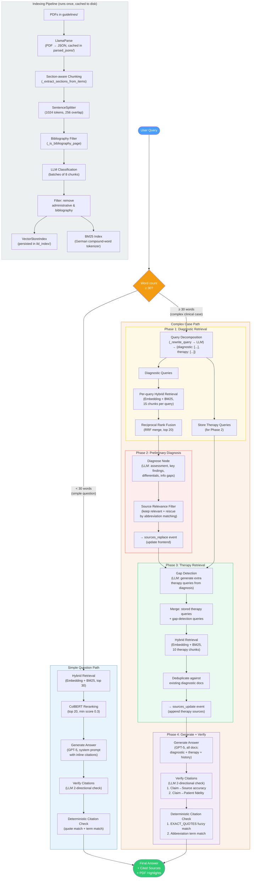

# RAG Pipeline Flowchart

```mermaid
flowchart TD
    START([User Query]) --> WORDCHECK{Word count<br/>≥ 30?}

    %% ===== INDEX (runs once at startup) =====
    subgraph INDEXING ["Indexing Pipeline (runs once, cached to disk)"]
        direction TB
        PDF["PDFs in guidelines/"] --> PARSE["LlamaParse<br/>(PDF → JSON, cached in parsed_jsons/)"]
        PARSE --> SECTION["Section-aware Chunking<br/>(_extract_sections_from_items)"]
        SECTION --> SPLIT["SentenceSplitter<br/>(1024 tokens, 256 overlap)"]
        SPLIT --> BIBFILT["Bibliography Filter<br/>(_is_bibliography_page)"]
        BIBFILT --> CLASSIFY["LLM Classification<br/>(batches of 8 chunks)"]
        CLASSIFY --> FILTADMIN["Filter: remove<br/>administrative & bibliography"]
        FILTADMIN --> VECIDX["VectorStoreIndex<br/>(persisted in ild_index/)"]
        FILTADMIN --> BM25IDX["BM25 Index<br/>(German compound-word tokenizer)"]
    end

    %% ===== SIMPLE PATH (< 30 words) =====
    WORDCHECK -- "< 30 words<br/>(simple question)" --> SIMPLE_RET

    subgraph SIMPLE ["Simple Question Path"]
        direction TB
        SIMPLE_RET["Hybrid Retrieval<br/>(Embedding + BM25, top 30)"]
        SIMPLE_RET --> COLBERT["ColBERT Reranking<br/>(top 20, min score 0.3)"]
        COLBERT --> SIMPLE_GEN["Generate Answer<br/>(GPT-5, system prompt<br/>with inline citations)"]
        SIMPLE_GEN --> SIMPLE_VER["Verify Citations<br/>(LLM 2-directional check)"]
        SIMPLE_VER --> SIMPLE_DET["Deterministic Citation Check<br/>(quote match + term match)"]
    end

    SIMPLE_DET --> OUTPUT

    %% ===== COMPLEX PATH (≥ 30 words) =====
    WORDCHECK -- "≥ 30 words<br/>(complex clinical case)" --> DECOMPOSE

    subgraph COMPLEX ["Complex Case Path"]
        direction TB

        subgraph PHASE1 ["Phase 1: Diagnostic Retrieval"]
            direction TB
            DECOMPOSE["Query Decomposition<br/>(_rewrite_query → LLM)<br/>→ {diagnostic: [...], therapy: [...]}"]
            DECOMPOSE --> DIAG_QUERIES["Diagnostic Queries"]
            DECOMPOSE --> STORE_THERAPY["Store Therapy Queries<br/>(for Phase 2)"]
            DIAG_QUERIES --> MULTI_RET["Per-query Hybrid Retrieval<br/>(Embedding + BM25,<br/>15 chunks per query)"]
            MULTI_RET --> RRF["Reciprocal Rank Fusion<br/>(RRF merge, top 20)"]
        end

        subgraph DIAG ["Phase 2: Preliminary Diagnosis"]
            direction TB
            DIAGNOSE["Diagnose Node<br/>(LLM: assessment, key findings,<br/>differentials, info gaps)"]
            DIAGNOSE --> RELEVANCE["Source Relevance Filter<br/>(keep relevant + rescue<br/>by abbreviation matching)"]
            RELEVANCE --> SOURCES_REPLACE["→ sources_replace event<br/>(update frontend)"]
        end

        subgraph PHASE3 ["Phase 3: Therapy Retrieval"]
            direction TB
            GAP["Gap Detection<br/>(LLM: generate extra<br/>therapy queries from diagnosis)"]
            GAP --> MERGE_TQ["Merge: stored therapy queries<br/>+ gap-detection queries"]
            MERGE_TQ --> THERAPY_RET["Hybrid Retrieval<br/>(Embedding + BM25,<br/>10 therapy chunks)"]
            THERAPY_RET --> DEDUP["Deduplicate against<br/>existing diagnostic docs"]
            DEDUP --> SOURCES_UPDATE["→ sources_update event<br/>(append therapy sources)"]
        end

        subgraph PHASE4 ["Phase 4: Generate + Verify"]
            <!-- direction TB -->
            GEN["Generate Answer<br/>(GPT-5, all docs:<br/>diagnostic + therapy + history)"]
            GEN --> VERIFY["Verify Citations<br/>(LLM 2-directional check)<br/>1. Claim→Source accuracy<br/>2. Claim→Patient fidelity"]
            VERIFY --> DET_CHECK["Deterministic Citation Check<br/>1. EXACT_QUOTES fuzzy match<br/>2. Abbreviation term match"]
        end

        RRF --> DIAGNOSE
        SOURCES_REPLACE --> GAP
        STORE_THERAPY --> GAP
        SOURCES_UPDATE --> GEN
    end

    DET_CHECK --> OUTPUT

    OUTPUT([Final Answer<br/>+ Cited Sources<br/>+ PDF Highlights])

    %% ===== STYLING =====
    style START fill:#4a9eff,color:#fff
    style OUTPUT fill:#2ecc71,color:#fff
    style WORDCHECK fill:#f39c12,color:#fff
    style INDEXING fill:#ecf0f1,stroke:#bdc3c7
    style SIMPLE fill:#e8f4fd,stroke:#3498db
    style COMPLEX fill:#fdf2e9,stroke:#e67e22
    style PHASE1 fill:#fef9e7,stroke:#f1c40f
    style DIAG fill:#fdedec,stroke:#e74c3c
    style PHASE3 fill:#eafaf1,stroke:#27ae60
    style PHASE4 fill:#f4ecf7,stroke:#8e44ad
```
